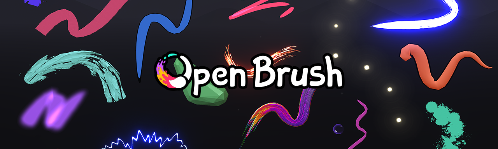

# Open Brush - Art From All Angles


[](https://crowdin.com/project/openbrushapp)
[](https://opencollective.com/icosa)
[](https://x.com/openbrushapp)
[](https://discord.gg/W7NCEYnEfy)


[](https://openbrush.app)

Open Brush is a free fork of Tilt Brush, a room-scale 3D-painting virtual-reality application available from Google, originally developed by Skillman & Hackett. We have made a large number of changes from the original repository, including Unity upgrades and feature additions to bring Open Brush up to modern XR development standards. You can find the notable changes on our [docs site](https://docs.openbrush.app/differences-between-open-brush-and-tilt-brush).

We hope to maintain and improve upon Tilt Brush as a community-led project, free forever!

As the original repo is archived we cannot submit PRs, so feel free to submit them here! 

[User Guide](https://docs.openbrush.app/)  
[Developer Notes](https://docs.openbrush.app/developer-notes)  
[Roadmap](https://github.com/orgs/icosa-foundation/projects/1)  
[Please join the Icosa Discord and get involved!](https://discord.com/invite/W7NCEYnEfy)  
[List of tutorials, write-ups and other things from the community](https://docs.google.com/document/d/1gjoYp4y-1qlE3a7fvXVxGR3ioj3nMfgprmTHQ-bpq0k/)  
[Support us on Open Collective](https://opencollective.com/icosa)  

## Downloads
### Stores
- [SideQuest](https://sidequestvr.com/app/2852/open-brush)
- [Meta Horizon (Quest)](https://www.oculus.com/experiences/quest/3600360710032222)
- [Steam](https://store.steampowered.com/app/1634870/Open_Brush)
- [Oculus Rift](https://www.oculus.com/experiences/rift/5227489953989768)
- [Viveport Desktop](https://www.viveport.com/f1f3d00b-cf8a-443f-825e-4fea2dd3b005)
- [Pico](https://store-global.picoxr.com/global/detail/1/7246792261630050310)
- [itch.io](https://openbrush.itch.io/openbrush)
### GitHub
- [Formal GitHub Releases](https://github.com/icosa-foundation/open-brush/releases/latest)
- [Bleeding Edge GitHub Releases](#bleeding-edge-releases)


## Acknowledgements
* Thank you to the Tilt Brush developers for your amazing work and for finding a way to open source the app! 
* [SiMonk0](http://www.furjandesign.com/) for the great new logo!
* The [SideQuest](https://sidequestvr.com/) team for your support.
* [VR Rosie](https://twitter.com/vr_rosie) for promotional artwork, banners, and videos.

## Bleeding Edge Releases

Instead of waiting for a formal release, you can download a ZIP from Github containing an automatically built release for either Windows (SteamVR) or Oculus Quest / Quest 2 from the [Github releases page](https://github.com/icosa-foundation/open-brush/releases). Versions of the form "vX.Y.0" are official releases, whereas versions that do not end in .0 are made available for testing purposes only, with no guarantees as to their quality. Additionally, these releases are marked as "pre-release". However, if you'd like to test a recent change prior to the official release, you can use these either in place of or in parallel with the formal Open Brush releases.

These builds share a save location with the official Open Brush release, but can be installed alongside the formal version. The Oculus build, like all sideloaded content, will be listed in "Unknown Sources", and will have the word "Github" appended to the name (with a different package name as well) to differentiate it from the official release).

Note that the "experimental" builds contain experimental brushes, and sketches created using the experimental brushes may appear differently when loaded in the official build of Open Brush!

In addition, there is also a version created for  Windows Monoscopic that is listed as an "Artifact" of the Github Actions, however, this is intended only for developers, and should not be used by general users. You can find it by browsing to the [commit list](https://github.com/icosa-foundation/open-brush/commits/main), and then clicking on the green check mark below the title (next to the XXX committed XXX ago), and scroll to the build you want, and click on **Details**. Then, towards the upper right corner, click on **Artifacts** and click on the name of the build. Unzip the downloaded file, and either run the executable (Desktop OpenXR/Monoscopic) or install the apk (Android Oculus) using `adb install com.Icosa.OpenBrush-github.apk`. 

## Important note from the original Tilt Brush README

The Tilt Brush trademark and logo (“Tilt Brush Trademarks”) are trademarks of
Google, and are treated separately from the copyright or patent license grants
contained in the Apache-licensed Tilt Brush repositories on GitHub. Any use of
the Tilt Brush Trademarks other than those permitted in these guidelines must be
approved in advance.

For more information, read the
[Tilt Brush Brand Guidelines](TILT_BRUSH_BRAND_GUIDELINES.md).

---

# Building the application

Get the Open Brush open-source application running on your own devices.

### Prerequisites

*   [Unity 2022.3.34f1](unityhub://2022.3.34f1/4886f5360533)
*   [Python 3](https://www.python.org/downloads/) (Optional —
    needed only if you wish to run the scripts in the `Support/bin` directory)
    Tested with Python 3.8.

### Running the application in the Unity editor

Follow these steps when running the application for the first time:

1.  Start Unity.
1.  Go to **File** > **Open Scene**. \
1.  Select `/Assets/Scenes/Main.unity`. Unity should automatically prompt you to
    import **TextMesh Pro**.
1.  Choose **Import TMP Essentials**. \
    You can also do this through **Window** > **TextMesh Pro** > **Import TMP
    Essential Resources**.
1.  Press **Play**.

These steps have been tested with Release 1.0.54.

### Building the application from the Unity editor

Although it's possible to build Open Brush using the standard Unity build tools,
we recommend using a build script to ensure the application builds with the
correct settings. To run this script, go to **Open Brush** > **Build** > **Do Build**,
or build from the Open Brush build window by navigating to **Open Brush** >
**Build** > **Build Window**.

Note: The application may take a while to build the first time.

### Building the application from the Windows command line

Use the `build` script in the `Support/bin` directory to specify the target
platform and the build options you wish to enable. Run `build —help` to see the
various build options.

### Additional features

You should be able to get the basic version of Open Brush up and running very
quickly. The following features will take a little more time.

*   [Google service API support](#google-service-api-support)
*   [Enabling native Oculus support](#enabling-native-oculus-support)
*   [Sketchfab support](#sketchfab-support)
*   [Offline rendering support](#offline-rendering-support)

## Systems that were replaced or removed when open-sourcing Tilt Brush

Some systems in Tilt Brush were removed or replaced with alternatives due to
open-source licensing issues. These are:

*   **Sonic Ether Natural Bloom**. The official Tilt Brush app uses a version
    purchased from the Asset Store; the open-source version uses
    [Sonic Ether's slightly modified open-source version](https://github.com/sonicether/SE-Natural-Bloom-Dirty-Lens).
*   **FXAA**. The official Tilt Brush app uses a modified version of the FXAA
    that Unity previously released with the standard assets on earlier versions
    of Unity - FXAA3 Console. This has been replaced with
    [FXAA by jintiao](https://github.com/jintiao/FXAA).
*   **Vignette and Chromatic Aberration**. The official Tilt Brush app uses
    modified versions of the Vignette and Chromatic Aberration effects that came
    with the standard assets in earlier versions of Unity. These have been
    replaced with a modified version of
    [KinoVignette by Keijiro](https://github.com/keijiro/KinoVignette).
*   **Tilt Shift**. The official Tilt Brush app uses modified versions of the
    Tilt Shift effect that came with the standard assets in earlier versions of
    Unity. These have been replaced with a modified version of
    [Tilt shift by ruby0x1](https://gist.github.com/ruby0x1/10324388).

## Generating Secrets file
Credentials for services such as Google and Sketchfab are stored in a `SecretsConfig` scriptable object. This has been ignored in the git config for safety. To add it back:

1.  Right click in the root `/Assets` folder in Unity's project window. 
    Select `Create`, then `Secrets Config`. This will create `Secrets.asset` in the Asset folder.
1.  In `Scenes/Main.unity` go to **App > Config** and replace `SecretsExample` 
    with the newly generated `Secrets.asset`.

## Google service API support

Set up Google API support to access Google services in the app.

### Enabling Google service APIs

Follow these steps when enabling Google service APIs:

1.  Create a new project in the
    [Google Cloud Console](https://console.developers.google.com/).
1.  Enable the following APIs and services:

    *   **YouTube Data API v3** — for uploading videos to YouTube
    *   **Google Drive API** — for backup to Google Drive
    *   **People API** — for username and profile picture

Note: The name of your application on the developer console should match the
name you've given the app in `App.kGoogleServicesAppName` in `App.cs`.

### Creating a Google API key

Follow these steps when creating a Google API key:

1.  Go to the Credentials page from the Google Cloud Console.
1.  Click **Create Credential** and select **API key** from the drop-down menu.

### Google OAuth consent screen information

The OAuth consent screen asks users for permission to access their Google
account. You should be able to configure it from the Credentials screen.

Follow these steps when configuring the OAuth consent screen:

1.  Fill in the name and logo of your app, as well as the scope of the user data
    that the app will access.
1.  Add the following paths to the list of scopes:

    *   Google Drive API `../auth/drive.appdata`
    *   Google Drive API `../auth/drive.file`

### Creating an OAuth credential

The credential identifies the application to the Google servers. Follow these
steps to create an OAuth credential:

1.  Create a new credential on the Credentials screen.
1.  Select **OAuth**, and then select **Desktop App**. Take note of the client ID and
    client secret values that are created for you. Keep the client secret a
    secret!

### Storing the Google API Key and credential data

Follow these steps to store the Google API Key and credential data:

1.  Follow the steps to [create your secrets file](#-Generating-Secrets-file).
    Add a new item to the **Secrets** field.
1.  Select `Google` as the service. Paste in the API key, client ID, and client
    secret that were generated earlier.

## Enabling native Oculus support

Open Brush targets OpenXR instead of Oculus by default. Follow these steps to enable native Oculus support:
.
1.  In the **Standalone** and **Android** tabs of the Player settings, go to **Other Settings** > **Scripting Define Symbols**.
1. Click the + button to create a new entry.
1. Add `OCULUS_SUPPORTED` and press **Apply**.

### Building your app for Oculus Quest

Follow these steps to build your app for Oculus Quest:

1.  Set up your machine for
    [Oculus Quest Development](https://developer.oculus.com/documentation/unity/book-unity-gsg/?device=QUEST).
1.  Make sure the following are set in Unity:
    *   **Open Brush** > **Build** > **Plugin: Oculus**
    *   **Open Brush** > **Build** > **Platform: Android**
    *   **Open Brush** > **Build** > **Runtime: IL2CPP**
1.  Navigate to **Open Brush** > **Build** > **Do Build**.
1.  Find the generated executable. It will most likely be somewhere under
    `../Builds/OculusMobile_Release_OpenBrush/`.
1.  Run `adb install com.Icosa.OpenBrush.apk`.

### Publishing to Oculus stores

Note: _Tilt Brush_ is a Google trademark. If you intend to publish a cloned
version of the application, you are required to
choose a different name to distinguish it from
the official version.

Follow these steps to publish to Oculus stores:

1.  Get an application ID from Oculus. The desktop and quest versions of each
    application need separate IDs.
1.  Follow the steps to [create your secrets file](#-Generating-Secrets-file).
    Add 2 new items to the **Secrets** field.
1.  Add these IDs to the `Secrets` file. Both `Oculus` and `OculusMobile` should
    have their own entries.
1.  Put the app IDs in the `Client ID` field for each.

## Open Brush intro sketch

The Open Brush intro sketch uses some slightly modified shaders to produce the
animating-in effect while the sketch fades in. For faster loading, the intro
sketch is turned into a `*.prefab` file beforehand. Only the shaders used in the
intro sketch have been converted to work with the introduction.

*   The current intro sketches are located in `Support/Sketches/Intro`. There
    are two versions, one for PC and one for mobile.
*   The `*.prefab` files are located in `Assets/Prefabs/Intro`.
*   The materials and shaders used in the intro are located in
    `Assets/Materials/IntroMaterials`.
*   The `Assets/PlatformConfigPC` and `Assets/PlatformConfigMobile` files
    reference the `*.prefab` files that will be used in the intro.

### Creating an intro sketch

Follow these steps to replace or alter the intro sketch:

1.  Make sure the sketch of your choice is already loaded. Run Open Brush in the
    Unity Editor.
1.  Select **Open Brush** > **Convert To Intro Materials** in the main Unity menu.
    This converts the materials in the sketch to the intro versions. \
    You will get warnings in the console for any materials it could not convert,
    as well as a summary of how many materials it converted.
1.  Navigate the hierarchy. Under the **Main** scene, open `SceneParent/Main
    Canvas`. Select any of the `Batch_...` objects to check whether they have
    the intro materials set.
1.  Move any objects that do not start with `Batch_` out from under the **Main
    Canvas** node.
1.  Select the **Main Canvas** node and run the **Open Brush** > **Save Game Object As Prefab**
menu command. \
    The scene will be saved as a `*.prefab` file called `gameobject_to_prefab`.
    under the `Assets/TestData` folder.
1.  Move the game object into the `Assets/Prefabs/Intro` folder.
1.  Update the references in `Assets/PlatformConfigPC` and
    `Assets/PlatformConfigMobile` to point to your new prefab file.

### Creating an intro sketch for mobile applications

You may want to have a pared-down version of the intro sketch for the mobile
version of the app. Stroke simplification is located in the **Settings** menu
inside Open Brush.

## New Scenes

By default, your app will only build the scenes defined in the **DoBuild** method (string[] scenes = {...} ) in `BuildTiltBrush.cs` under  `Assets/Editor/`. Make sure to add your custom scenes to this array if you want to see them in app.

## Sketchfab support

Follow these steps to enable Sketchfab support:

1.  [Contact Sketchfab](https://sketchfab.com/developers/oauth) for a client ID
    and secret before you can upload to their service.
    
    -  The **Application Name** will probably need to be changed
    -  The **Grant Type** should be **Authorization Code** 
    -  The **URI** should be **http://localhost:40074/sketchfab**
1.  Follow the steps to [create your secrets file](#-Generating-Secrets-file).
    Add a new item to the **Secrets** field.
1.  Add the client ID and secret to the field.
1.  Set the service as **Sketchfab**. Leave the API key blank.

### Video support bug fix

If you add video support, you may encounter a bug where the "Looking for audio"
and "Play some music on your computer" text will disappear if the controller is
angled too far. Fix this by doing the following:

1.  In Unity, find the `/Assets/TextMesh Pro/Resources/Shaders/TMP_SDF.shader`
    file.
1.  Duplicate it and rename this file `TMP_SDF-WriteDepth.shader`.
1.  Open the new file in a code or text editor and make the following changes to
    it:
    1.  Change the name from `TextMeshPro/Distance Field` to
        `TextMeshPro/Distance Field Depth`.
    1.  Change `Zwrite Off` to `Zwrite On`.
1.  In Unity, select `/Assets/Fonts/Oswald-Light SDF.asset`.
1.  Under `Atlas & Material`, double click `Oswald-Light SDF Material`.
1.  At the top, change the name for `Shader` from `TextMeshPro/Distance Field`
    to `TextMeshPro/Distance Field Depth`.

## Offline rendering support

When the user records a video from a saved sketch in Open Brush, a `.bat` file
is generated next to the `.mp4` for offline rendering support. This `.bat` file
requires the path to the executable of Open Brush. The code for writing out this
path to the file has been removed.

Follow these steps to restore the path:

1.  Open the file `Assets/Scripts/Rendering/VideoRecorderUtils.cs` in a code or
    text editor.
1.  Look for the function `CreateOfflineRenderBatchFile` near the bottom of the
    file.
1.  In the function, find the comments on how to modify the string to point to
    the executable path.
1.  Update the string to point to the correct path.

## Experimental mode

Experimental mode is where features live before they are ready to be released in
a production build. This mode enables the experimental brushes and experimental
panel while disabling the intro sequence. Experimental mode can be enabled from
the settings panel, and requires a restart.

**New features and brushes that you find in experimental mode may not work as
expected.** Sketches that use experimental features and brushes won't work on
Icosa or Sketchfab, and may break if loaded into production versions of Open
Brush.

### Making your code experimental

Code in experimental mode is usually surrounded by the following block:

```
    if (Config.IsExperimental) {
      // Experimental code goes here
    }
```

### Experimental brushes

Experimental brushes and environments are located in the `Assets/Resources/X`
folder. They are not visible in non-experimental mode.
